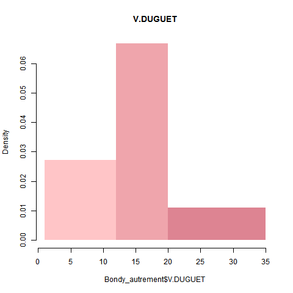
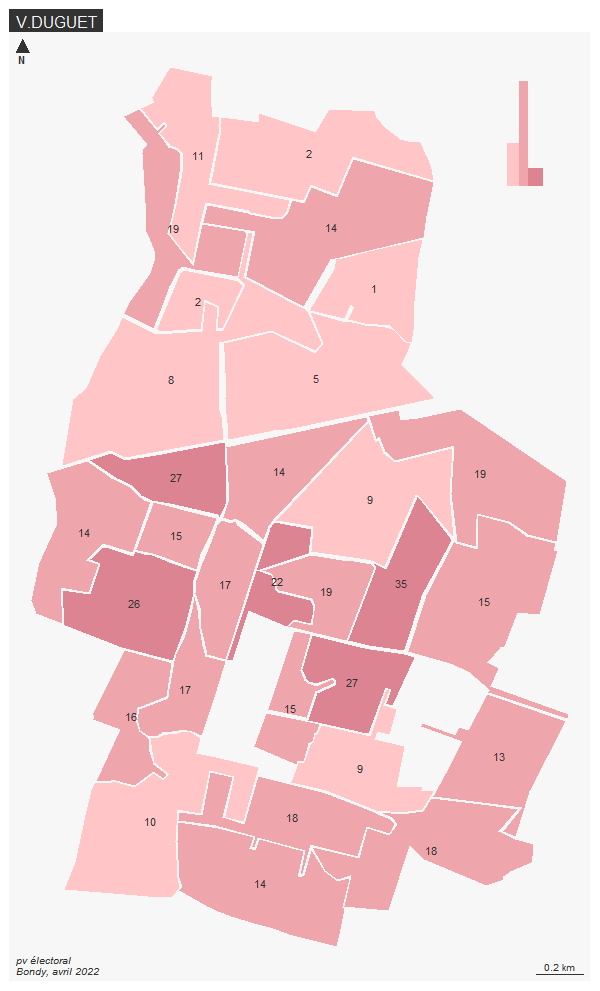
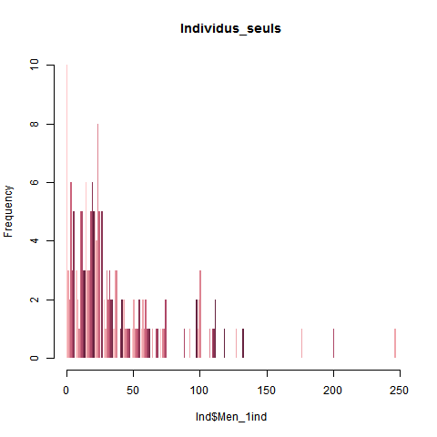
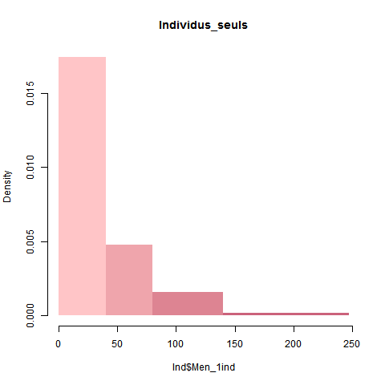
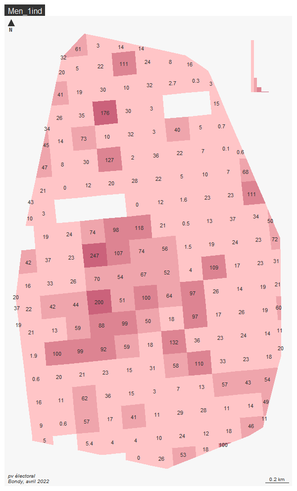

```{r setup, include=FALSE}
knitr::opts_chunk$set(echo = TRUE)
knitr::opts_chunk$set(cache = TRUE)
# Passer la valeur suivante à TRUE pour reproduire les extractions.
knitr::opts_chunk$set(eval = T)
knitr::opts_chunk$set(warning = FALSE)
```

# Cartes votes et Insee

## Carte votes

### Importation et observation
```{r}
library(sf)
Votes<- st_read("../data/vote.gpkg", "jointure")
names(Votes)
```
Les seules données pertinentes à représenter sont le nombre de votes blancs et, surtout, les résultats des listes éléctorales.
```{r}
summary(Votes[14:18])
```
On voit deux grands candidats. Nous allons choisir la liste du troisième candidat qui n'est pas insignifiant avec une moyenne de 15 votes par bureau, V.DUGUET.

```{r}
Bondy_autrement <- Votes[17]
names(Bondy_autrement)[1] <- ("V.DUGUET")
Bondy_autrement
```

### Discrétisation

Commençons par une première cartographie sur leaflet.
```{r}
library(leaflet)
leaflet() %>% addTiles()
Bondy_autrement <- st_transform(Bondy_autrement, 4326)
pal <- colorNumeric(
  palette = "YlOrRd",
  domain = Bondy_autrement$V.DUGUET
)
leaflet(Bondy_autrement) %>%
  addPolygons(color = "#444444", weight = 1, smoothFactor = 0.5,
    opacity = 1.0, fillOpacity = 0.5,
    fillColor = ~colorQuantile("YlOrRd", V.DUGUET)(V.DUGUET),
    highlightOptions = highlightOptions(color = "white", weight = 2,
      bringToFront = TRUE)) %>% addLegend("bottomright", pal = pal, values = ~V.DUGUET,
    title = "Nb",
    opacity = 1
  ) %>% addTiles()
```
On voit une nette fracture entre Sud et Nord que la discrétisation devra mettre en avant.

```{r}
library(mapsf)
png("../img/histo.png")
seuil <- seq(1,35)
hist(Bondy_autrement$V.DUGUET, breaks = seuil, col = hcl.colors(7,"Burg", rev = T), right = F,
     border = NA, main = "V.DUGUET")
dev.off()
```
 
 En regardant l'histogramme, on veut mettre en valeur les deux extrêmes de votes mais aussi l'importance des valeurs centrales.
 On propose donc de faire trois catégories avec ces seuils : 1,12,20,35

```{r}
library(mapsf)
png("../img/histo2.png")
seuils <- c(1,12,20,35)
hist(Bondy_autrement$V.DUGUET, breaks = seuils, col = hcl.colors(7,"Burg", rev = T), right = F,
     border = NA, main = "V.DUGUET")
dev.off()
```
  
 L'histogramme est satisfaisant. On peut procéder à la réalisation de la carte.
 
### Carte finale
 
```{r}
Votes[19]
Bondy_autrement$geom <- Votes$geom
Bondy_autrement
mf_export(Bondy_autrement, filename =  "../img/resultat.png")
mf_map(Bondy_autrement, type = "choro" ,var = "V.DUGUET", breaks = seuils, pal =  hcl.colors(7,"Burg", rev = T), leg_pos = "n" , border = NA)
mf_label(Bondy_autrement, "V.DUGUET")
mf_layout("V.DUGUET",credits = "pv électoral\nBondy, avril 2022")
mf_inset_on (Bondy_autrement, pos = "topright")
par(mar = c(2,2,2,2))
hist(Bondy_autrement$V.DUGUET, breaks = seuils, col = hcl.colors(7,"Burg", rev = T), right = F,
     border = NA, main = "", xlab = "", ylab = "", axes = F)
mf_inset_off()
dev.off()
```
 

La carte illsutre bien que V.DUGUET remporte les suffrages méridionaux mais qu'il est dédaigné au Nord. Ce n'est pas probablement pas sans rapport avec la pauvreté plus présente au Nord.

## Carte Insee

### Importation et observation
```{r}
Insee<- st_read("../data/insee.gpkg", "bondy")
names(Insee)
```
On consulte le dictionnaire Insee. Nons allons nous intéresser à Men_1ind : Nombre de ménages d’un seul individu.

```{r}
Ind <- Insee[12]
summary(Ind)
```

### Discrétisation

Commençons par une première cartographie sur leaflet.
```{r}
library(leaflet)
leaflet() %>% addTiles()
Ind <- st_transform(Ind, 4326)
pal <- colorNumeric(
  palette = "YlOrRd",
  domain = Ind$Men_1ind
)
leaflet(Ind) %>%
  addPolygons(color = "#444444", weight = 1, smoothFactor = 0.5,
    opacity = 1.0, fillOpacity = 0.5,
    fillColor = ~colorQuantile("YlOrRd", Men_1ind)(Men_1ind),
    highlightOptions = highlightOptions(color = "white", weight = 2,
      bringToFront = TRUE)) %>% addLegend("bottomright", pal = pal, values = ~Men_1ind,
    title = "Nb",
    opacity = 1
  ) %>% addTiles()
```
On remarque que le centre de Bondy est le plus dense en individus seuls, la discrétisation devra le mettre en valeur.

```{r}
library(mapsf)
png("../img/histo3.png")
seuil1 <- seq(0,247)
hist(Ind$Men_1ind, breaks = seuil1, col = hcl.colors(7,"Burg", rev = T), right = F,
     border = NA, main = "Individus_seuls")
dev.off()
```
 
 En regardant l'histogramme, on veut mettre en valeur la grande fréquence de la rareté des ménages d'un seul individu. 
 On propose donc de faire ces quatre catégories avec ces seuils : 0,40,80,140,247

```{r}
library(mapsf)
png("../img/histo4.png")
seuils2 <- c(0,40,80,140,247)
hist(Ind$Men_1ind, breaks = seuils2, col = hcl.colors(7,"Burg", rev = T), right = F,
     border = NA, main = "Individus_seuls")
dev.off()
```
  
 L'histogramme est satisfaisant. On peut procéder à la réalisation de la carte.
 
### Carte finale
 
 Les trois premières lignes servent à abandonner la projection 4326 nécessaire pour le leaflet.
```{r}
Insee[43]
Ind$geom <- Insee$geom
Ind
mf_export(Ind, filename =  "../img/resultat2.png")
mf_map(Ind, type = "choro" ,var = "Men_1ind", breaks = seuils2, pal =  hcl.colors(7,"Burg", rev = T), leg_pos = "n" , border = NA)
mf_label(Ind, "Men_1ind")
mf_layout("Men_1ind",credits = "pv électoral\nBondy, avril 2022")
mf_inset_on (Ind, pos = "topright")
par(mar = c(2,2,2,2))
hist(Ind$Men_1ind, breaks = seuils2, col = hcl.colors(7,"Burg", rev = T), right = F,
     border = NA, main = "", xlab = "", ylab = "", axes = F)
mf_inset_off()
dev.off()
```
 

La carte illutre bien la centralité des ménages à un seul individu. Cela pourrait s'expliquer si le centre de Bondy est plus urbanisé, le cas échéant les familles nombreuses préféreront s'installer où elles trouveront plus de place, laissant les individus seuls peupler le centre.
 
 
 