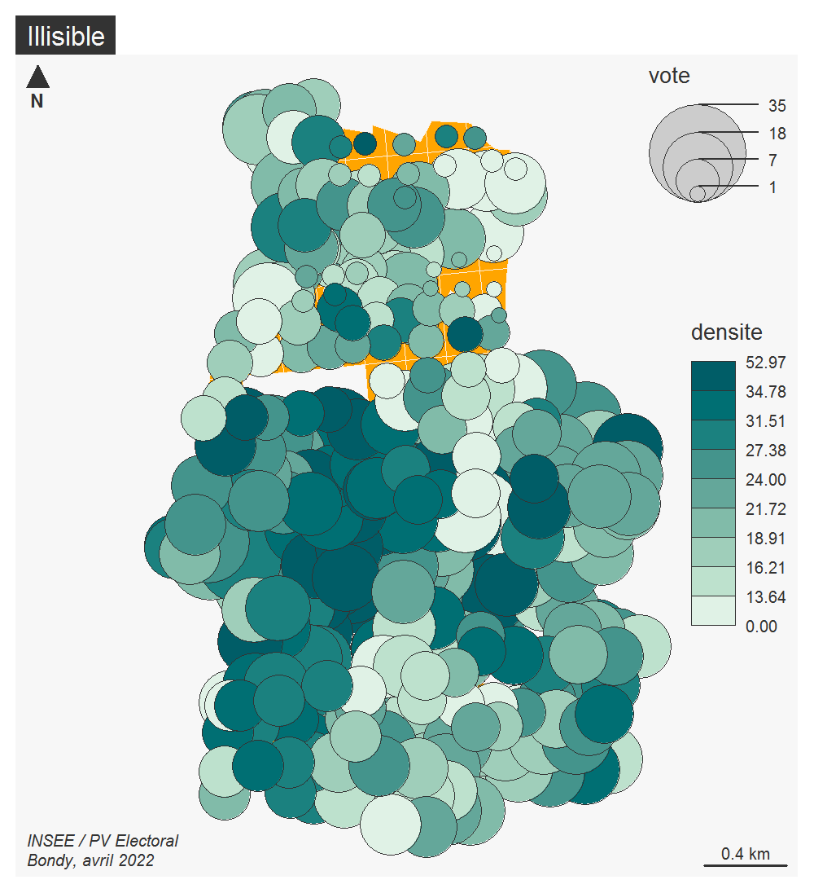
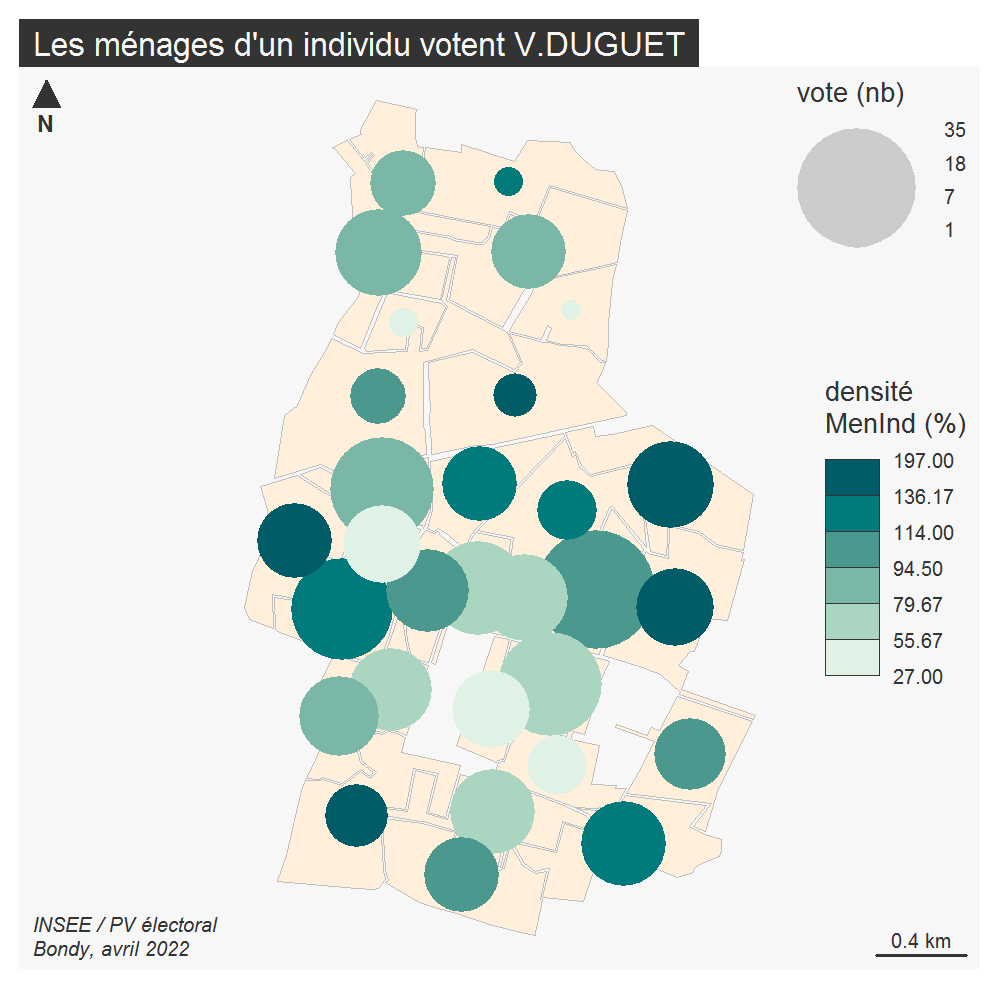

```{r setup, include=FALSE}
knitr::opts_chunk$set(echo = TRUE)
knitr::opts_chunk$set(cache = TRUE)
# Passer la valeur suivante à TRUE pour reproduire les extractions.
knitr::opts_chunk$set(eval = T)
knitr::opts_chunk$set(warning = FALSE)
```


# Superposition vote et carroyage
Hypothèse : les individus vivant seuls ont une propension à voter pour V.DUGUET.


## Préparation de la donnée

```{r}
library(sf)
library(mapsf)
Insee_bondy <- st_read("../data/insee.gpkg","bondy")
Votes<- st_read("../data/vote.gpkg", "jointure")
names(Votes)
Votes[3]
```

```{r}
names(Votes)[c(3,17)] <- c("bureau", "vote")
Votes <- Votes [, c("bureau", "vote")]
# Pour obtenir un chiffre relatif, on divise le nombre de ménages d'un individu par le nombre de ménages total
Insee_bondy$densite <- (Insee_bondy$Men_1ind / Insee_bondy$Men)*100
Insee_bondy <- Insee_bondy [, "densite"]
hist(Insee_bondy$densite, main = "densité des ménages d'un individu")
```
En général à Bondy, il y a entre 15 et 25% de ménage d'un individu. On remarque une valeur exceptionnelle de plus de 50%, sûrement au centre.

## Traitement de la donnée
### Intersection

Afin de pouvoir croiser grille et polygone, il faut d’abord intersecter les deux de façon à récupérer le nom du bureau de vote pour chaque carreau de la grille.
```{r}
inter <- st_intersection(Votes, Insee_bondy)
summary(inter)
```
```{r}
# la cartographie des multipolygones ne fonctionne pas, on passe tout en polygone
inter <- st_cast(inter, "POLYGON")
```

### Une première cartographie

```{r}
mf_export(inter, filename ="../img/propchoroF.png", width = 1000, res = 200, expandBB = c(0,0,0,0.6))
mf_map(inter, col = "orange", border = "antiquewhite1")
mf_map(inter, type ="prop_choro", var = c("vote", "densite"), leg_pos = c("topright", "right"))
mf_layout("Illisible", credits = "INSEE / PV Electoral\nBondy, avril 2022")
dev.off()
```

La carte est illisible.

## Agrégation
Pour chaque bureau de vote, il faut calculer la somme de la densité des ménages d'un individu.

On intersecte insee et bureaux, puis on calcule la densité ménages par rapport à la taille du carreau, puis on fait la somme de tous les carrés dans un bureau.

Les carreaux du carroyage devraient faire 40000 m2 chacun. Or ce n'est pas le cas :
```{r}
st_area(inter)
st_area(Insee_bondy)
```
Ces variation sont dues aux différentes intersection entre carreaux et bureaux. Pour obtenir une juste densité, il faut tout de même tenir compte de la superficie.
```{r}
# Il ne faut pas oublier les carreaux frontières...
# certains carreaux sont coupés par les limites des bureaux. la densité des ménages doit être rapportée à l'aire de la géométrie.
#On crée un champ pour l'aire totale :
Insee_bondy$aireTot <- st_area(Insee_bondy)
inter <- st_intersection(Votes, Insee_bondy)
# On fait le rapport : proportion de ménages pauvres x aire du carreau intersécté/aire totale du carreau.
inter$nbRel <- (inter$densite * (st_area(inter)/ inter$aireTot) )
hist(inter$nbRel, main = "densité des ménages d'un individu relatif à la taille des carreaux", xlab = "valeur de la densité", ylab = "fréquence")
```
Ici, en utilisant la taille des parties de carreaux, on obtient beaucoup de zones avec une densité faible et quelques unes avec une grosse densité.

```{r}
# Enfin, on agrége les carreaux aux bureaux
agg <- aggregate (inter$nbRel , by = list(inter$bureau), sum )
agg
```
```{r}
# On renomme pour faire la jointure.
names(agg) <- c("bureau", "densite")
# jointure
names(Votes)
jointure <- merge(Votes, agg, by = "bureau")
names(jointure)
```
```{r}
jointure$densite <- round(jointure$densite,0)
jointure$densite
```
```{r}
# Problème sur les unités en mètres carrés, il faut s'en débarasser.
library(units)
jointure$densite <- drop_units(jointure$densite)
```

```{r}
mf_export(inter, filename ="../img/superp.png", width = 1000, res = 200, expandBB = c(0,0,0,0.8))
mf_map(jointure, col = "antiquewhite1", border = "grey")
mf_map(jointure, type ="prop_choro", var = c("vote", "densite"), border = NA, leg_pos = c("topright", "right"), leg_title = c("vote (nb)", "densité\nMenInd (%)"))
mf_layout(title = "Les ménages d'un individu votent V.DUGUET", credits = "INSEE / PV électoral\nBondy, avril 2022")
dev.off()
```

En réalité la carte conteste cette conclusion : les cercles les plus foncés ne sont pas les plus grands, la relation entre votes de V.DUGUET et densité des menages individuels n'est pas avérée.